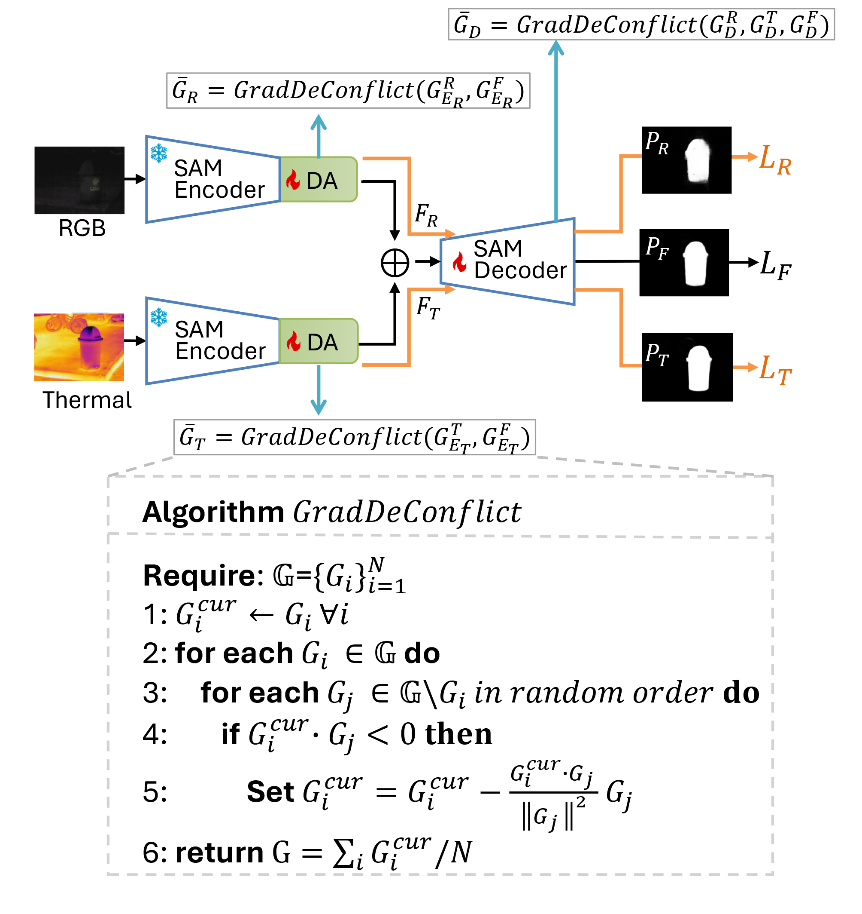

# SAMSOD
SAMSOD: Rethinking SAM Optimization for RGB-T Salient Object Detection
has been accepted by TMM.
# 代码
通过网盘分享的文件：代码
链接: https://pan.baidu.com/s/1LBFiMXWrHJHmStABbE0geQ 提取码: 3fqc 

# 结果显著图
通过网盘分享的文件：预测图
链接: https://pan.baidu.com/s/1mNyjdJgYU61NtiYiB-JXEA 提取码: n1rw 

# 参数
通过网盘分享的文件：sam_rgbt.pth
链接: https://pan.baidu.com/s/1CAT3FerS7hYHE72Dhdu-pA 提取码: t66g 

