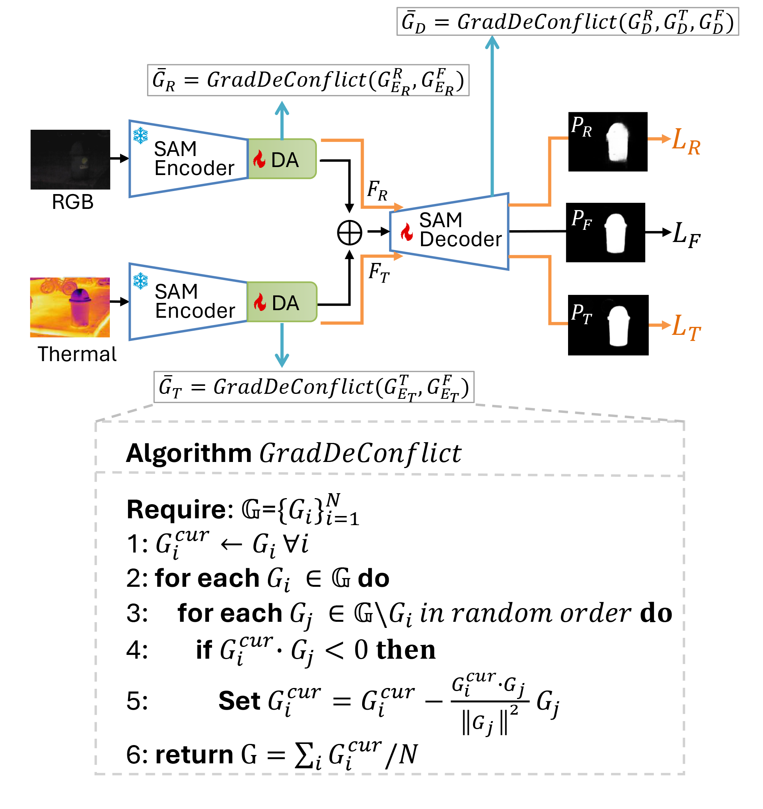

# SAMSOD
SAMSOD: Rethinking SAM Optimization for RGB-T Salient Object Detection
has been published by TMM. 
DOI: https://doi.org/10.1109/TMM.2026.3654410
# 论文

# 代码
通过网盘分享的文件：代码
链接: https://pan.baidu.com/s/1LBFiMXWrHJHmStABbE0geQ 提取码: 3fqc 

# 结果显著图
通过网盘分享的文件：预测图
链接: https://pan.baidu.com/s/1mNyjdJgYU61NtiYiB-JXEA 提取码: n1rw 

# 参数
通过网盘分享的文件：sam_rgbt.pth
链接: https://pan.baidu.com/s/1CAT3FerS7hYHE72Dhdu-pA 提取码: t66g 

# Cite
@article{liu2026samsod,

  title={SAMSOD: Rethinking SAM optimization for RGB-T salient object detection},
  
  author={Liu, Zhengyi and Wang, Xinrui and Fang, Xianyong and Tu, Zhengzheng and Wang, Linbo},
  
  journal={IEEE Transactions on Multimedia},
  
  pages={3869--3879},
  
  year={2026},
  
  publisher={IEEE}
  
}
